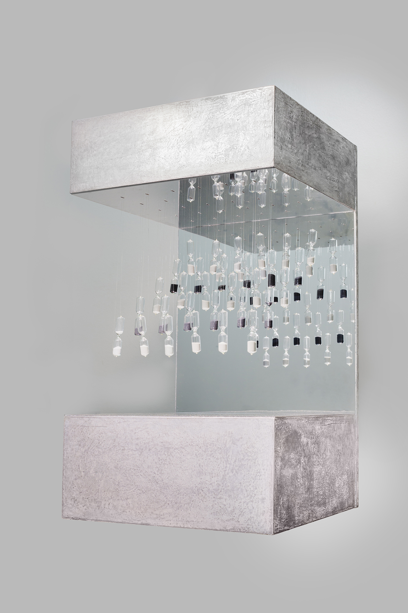

## FLIPPER — Escultura cinética com Arduino (PT) / Kinetic sculpture with Arduino (EN)

### Português

**Descrição**

FLIPPER é uma escultura cinética de ampulhetas controlada por três placas Arduino. Ao todo são até 30 servomotores distribuídos em 5 fileiras, movimentando as ampulhetas de forma coordenada e defasada no tempo. O projeto utiliza controle não bloqueante com `millis()` e escalona a ativação dos servos por placa e por índice de servo.

**Arquitetura das placas**
- **Placa 0**: controla as fileiras 1 e 2 (mais ao fundo e mais altas), até 12 servos (pinos 2–13)
- **Placa 1**: controla as fileiras 3 e 4, até 12 servos (pinos 2–13)
- **Placa 2**: controla a fileira 5 (mais baixa e frontal), 6 servos (pinos 2–7)

**Atenção e segurança**
- Todas as ligações e programações devem ser feitas com o sistema desligado da rede elétrica.
- Em caso de qualquer anormalidade, desligue imediatamente da rede elétrica e corrija a falha.
- A fonte é bivolt e está regulada para receber 110 V. Para utilizar em 220 V, altere a chave seletora dentro da fonte de alimentação conforme especificação do fabricante.

**Conexões dos servos (sinal)**
- Pinos de cada Arduino: `2, 3, 4, 5, 6, 7, 8, 9, 10, 11, 12, 13`
- Placas 0 e 1 usam até 12 servos (2–13). A Placa 2 usa 6 servos (2–7).
- O servo mais à esquerda de cada fileira conecta-se ao menor pino do grupo (2 ou 8) e os demais seguem em pinos vizinhos.

**Arquivos e código**
- Código principal: `FLIPPER_V1/FLIPPER_V1/FLIPPER_V1.ino`
- Biblioteca: `Servo.h`

**Configuração antes de enviar para cada placa**
1) Abra o projeto no Arduino IDE.
2) Conecte uma placa por vez via USB e selecione a porta correta.
3) No código, ajuste a variável que indica o número da placa:
   - Para a Placa 0: `byte PLACA = 0;`
   - Para a Placa 1: `byte PLACA = 1;`
   - Para a Placa 2: `byte PLACA = 2;`
4) Envie o código para a placa atual. Repita para as demais.

**Principais parâmetros ajustáveis (no código)**
- `byte PLACA` — identifica a placa (0, 1 ou 2). Define também o número de servos ativos na Placa 2 (6).
- `#define NumTotalMotores 30` — total lógico de servos no sistema.
- `byte NMPPlaca = 12` — número base de servos por placa para cálculo de offsets.
- `long tempobaseServo = 240000` — tempo base entre movimentos em ms (padrão 4 min).
- `byte offsetServo = 500` — defasagem adicional por servo em ms (cria efeito cascata entre servos/placas).
- `int tempoAtivoLinha = 1600` — tempo que cada servo permanece fora do centro por ciclo (ms).
- `byte velocidade = 30` — amplitude do comando a partir do centro para girar o servo.
- `byte servoPins[] = {2..13}` — pinos de sinal dos servos em cada placa.
- `byte servoCentro[] = {...}` — calibração do centro de cada servo (majoritariamente 94; um canal está em 90). Ajuste aqui se necessário.

**Funcionamento**
- Cada servo parte do ângulo de centro calibrado e alterna a direção a cada ciclo.
- A ativação é escalonada: `tempobaseServo` + `offsetServo` por índice e por placa, evitando movimentos simultâneos.
- A Placa 2 limita `NumMotores` a 6 automaticamente.

**Preparação das ampulhetas e início**
1) Com a obra posicionada e estável, gire manualmente cada ampulheta para que o fio de nylon fique visível na frente.
2) Verifique se polias e parafusos estão firmes em cada motor (não podem girar em falso).
3) Ligue a obra na rede elétrica de 110 V. Para 220 V, ajuste a chave seletora da fonte conforme indicado.
4) Observe por ao menos 15 minutos para checar se todos os motores giram adequadamente e se não há cabos enroscados.

**Requisitos**
- Arduino IDE (versão atual) e biblioteca padrão `Servo`.
- 3 placas Arduino compatíveis com `Servo.h` (ex.: Uno/Nano/Mega, conforme o hardware do projeto).
- Fonte DC adequada aos servos e ao conjunto, conforme especificação do projeto físico.

**Solução de problemas**
- Servo não movimenta: confirme pino de sinal, alimentação do servo e aterramento comum.
- Movimento no sentido errado ou desalinhado: ajuste `servoDirecao[]` (no código) ou corrija a montagem mecânica.
- Centro incorreto: recalibre o valor correspondente em `servoCentro[]` para o canal afetado.
- Sequência irregular: revise `tempobaseServo` e `offsetServo` para o efeito desejado.

—

### English

**Description**

FLIPPER is a kinetic hourglass sculpture driven by three Arduino boards. It controls up to 30 servos arranged in 5 rows and moves them in a coordinated, time‑staggered pattern. The firmware uses non‑blocking scheduling with `millis()` and offsets per board and per servo.

**Board layout**
- **Board 0**: rows 1 and 2 (rear, higher), up to 12 servos (pins 2–13)
- **Board 1**: rows 3 and 4, up to 12 servos (pins 2–13)
- **Board 2**: row 5 (front, lower), 6 servos (pins 2–7)

**Safety**
- Perform all wiring and programming with the system disconnected from mains power.
- If any abnormality occurs, disconnect immediately and fix before powering again.
- The PSU is dual‑voltage and set to 110 V input. For 220 V, change the internal selector as specified by the PSU manufacturer.

**Servo signal wiring**
- Arduino pins per board: `2, 3, 4, 5, 6, 7, 8, 9, 10, 11, 12, 13`
- Boards 0 and 1 use up to 12 servos (2–13). Board 2 uses 6 servos (2–7).
- The leftmost servo in each row connects to the first pin of its group (2 or 8) and the remaining follow in adjacent pins.

**Files and code**
- Main sketch: `FLIPPER_V1/FLIPPER_V1/FLIPPER_V1.ino`
- Library: `Servo.h`

**Per‑board configuration before upload**
1) Open the project in Arduino IDE.
2) Connect one board at a time via USB and select the correct port.
3) Set the board ID in the sketch:
   - For Board 0: `byte PLACA = 0;`
   - For Board 1: `byte PLACA = 1;`
   - For Board 2: `byte PLACA = 2;`
4) Upload to the connected board and repeat for the others.

**Key tunables (in code)**
- `byte PLACA` — board identifier (0, 1, 2). Also limits Board 2 to 6 servos.
- `#define NumTotalMotores 30` — logical total of servos in the system.
- `byte NMPPlaca = 12` — base servos per board used for offsets.
- `long tempobaseServo = 240000` — base delay between moves in ms (default 4 min).
- `byte offsetServo = 500` — additional per‑servo offset in ms (stagger effect).
- `int tempoAtivoLinha = 1600` — time a servo stays away from center per cycle (ms).
- `byte velocidade = 30` — amplitude from center for the move command.
- `byte servoPins[] = {2..13}` — servo signal pins per board.
- `byte servoCentro[] = {...}` — center calibration per servo (mostly 94; one channel is 90). Adjust if needed.

**How it works**
- Each servo moves away from its calibrated center and alternates direction every cycle.
- Activation is time‑staggered using `tempobaseServo` and `offsetServo` by board and by servo index.
- Board 2 automatically limits `NumMotores` to 6.

**Preparing the hourglasses and start‑up**
1) With the piece positioned and stable, manually rotate each hourglass so the nylon string is visible at the front.
2) Ensure pulleys and screws are firmly attached to each motor (no slipping).
3) Power the artwork at 110 V. For 220 V, set the PSU selector accordingly.
4) Observe for at least 15 minutes to check for proper motion and cable tangles.

**Requirements**
- Arduino IDE (current version) and the standard `Servo` library.
- 3 Arduino boards compatible with `Servo.h` (e.g., Uno/Nano/Mega, according to your hardware).
- Proper DC power supply sized for the servos and the whole setup.

**Troubleshooting**
- Servo not moving: verify signal pin, servo power, and common ground.
- Wrong direction or misalignment: adjust `servoDirecao[]` in code or fix mechanical assembly.
- Wrong center: tune the corresponding entry in `servoCentro[]`.
- Irregular sequencing: review `tempobaseServo` and `offsetServo` for the desired effect.

—

Se desejar, adicione fotos/diagramas das ligações e da obra nas seções acima. | You may add photos/diagrams of the wiring and the piece in the sections above.

